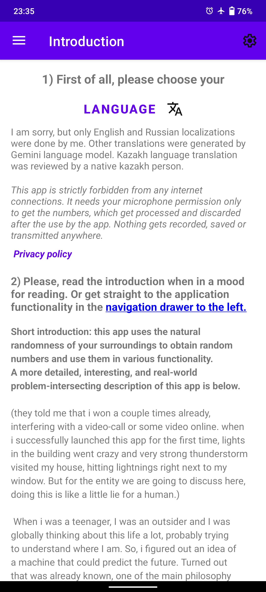
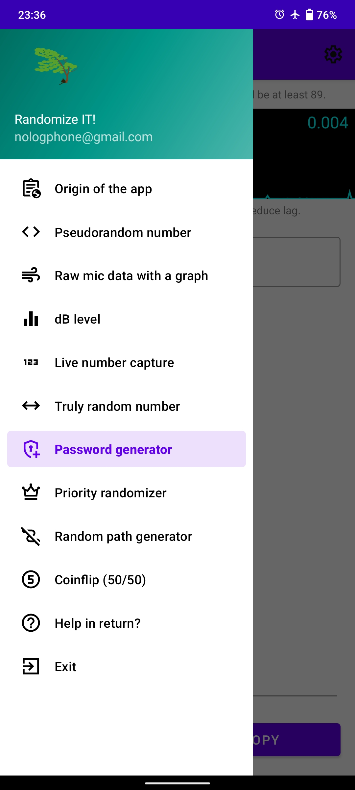
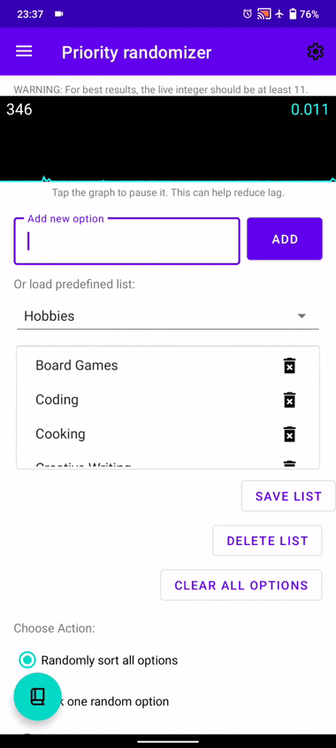
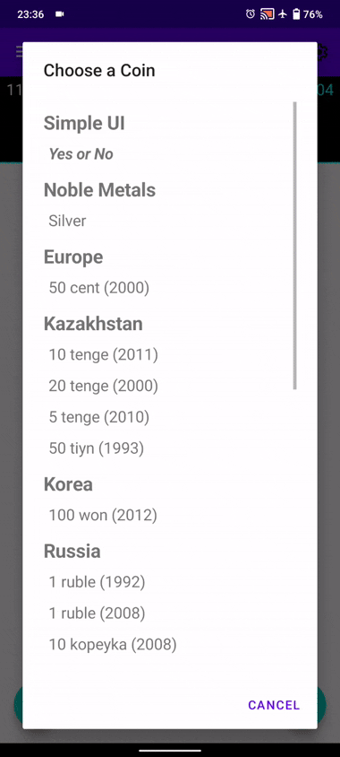

# truly-random-numbers-utilized-Android-app
I've developed this app while arguing with destiny. Lightnings strike just near my windows when it started first time, demons almost made me cry again after that. And, of course, hidden AI network spreaded on every smartphone showed itself too. It could hack this exact app easily but the way how the app works could be used on pure hardware. The app's internet access is strictly blocked in the root of the Android Studio code.

- **Complex Math:** The program processes digits into numbers, squeezes them through formiulas generating pure humane output.
- **True Randomness:** A loud street with many sound sources with naturally many sources of amplitude(sound loudness) generate truly random number at your smartphone's microphone.
- **Functionality:** All the functionality I was able to figure out was implemented within this app.
- **Complex math vs Total control:** I was thinking for hour straight in order to figure out the formulas on a "subatomic" level in terms of statistics and predictability\3rd party control. It was very hard due to Gemini hidden algorithms crashing when creating such a code or trying to confuse me in an opposite way. Moreover, my mind was always blocking such thoughts and i had to focus, stay calm nevertheless the stupidity demon and keep the work going.
- **Long-time development:** Creating this app took about 7 months due to factors listed above and a full-time job.

  <!-- Два вертикальных изображения рядом -->
  <table>
    <tr>
      <td align="center">
        
         
        <i>Introductory page.</i>
      </td>
      <td align="center">
        
         
        <i>Menu of all functionality.</i>
      </td>
    </tr>
  </table>
    <!-- Два вертикальных изображения рядом -->
  <table>
    <tr>
      <td align="center">
        
         
        <i>GIF(Click) Priority randomizer page.</i>
      </td>
      <td align="center">
        
         
        <i>GIF(Click) Coinflip page (the initial idea).</i>
      </td>
    </tr>
  </table>

 
